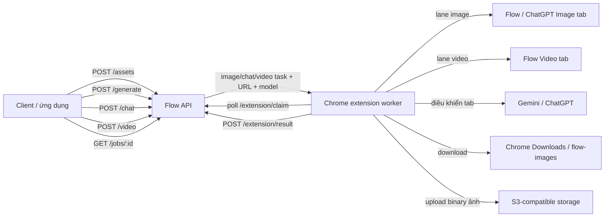

# Kiến trúc

## Mục tiêu hiện tại

Biến phiên đăng nhập trong Chrome thành worker nội bộ cho ba loại job: tạo ảnh bằng Google Flow hoặc ChatGPT web, tạo video bằng Google Flow và chat bằng Gemini hoặc ChatGPT web. API producer không cần điều khiển browser trực tiếp.



## Thành phần

### API server

`flow_api.mjs` dùng module HTTP chuẩn của Node.js và Turso làm kho job/queue bền vững.

- nhận asset, image job, video job và chat job;
- validate prompt, worker, ratio, model và URL;
- lưu job, queue, tiến độ và kết quả vào Turso;
- cấp từng prompt cho extension bằng lease;
- nhận kết quả và cập nhật trạng thái;
- có thể spawn Playwright worker cho job legacy.

Runtime files:

```text
.flow-api/assets/       ảnh tham chiếu upload
.flow-api/jobs/         prompt/output của Playwright worker
.flow-chrome-profile/   persistent profile của Playwright worker
```

### Extension service worker

`flow-extension/worker.js`:

- poll API bằng Chrome Alarm khoảng 0,1 phút;
- tải ảnh tham chiếu thành data URL;
- tìm/mở tab Google Flow, Gemini hoặc ChatGPT phù hợp theo loại task;
- dùng Chrome Debugger Protocol để click, gõ text và gán file;
- dùng Chrome Downloads API để lưu output ảnh và gửi binary về API để upload S3;
- báo success/error về API.

### Flow content script

`flow-extension/flow.js` chạy trong `https://labs.google/fx/*`:

- chọn mode, tỉ lệ và số ảnh x1–x4;
- mở media picker và attach ảnh tham chiếu;
- tìm editor Flow và nhập prompt bằng keyboard events;
- click nút Generate;
- phát hiện đủ số output mới;
- lần lượt mở từng ảnh lớn và yêu cầu worker tải xuống.

### Gemini content script

`flow-extension/gemini.js` chạy trong `https://gemini.google.com/*`:

- chủ động chọn 3.5 Flash Lite khi request bỏ `model`, hoặc chọn 3.1 Pro khi được yêu cầu;
- tìm đúng prompt editor, loại trừ editor clipboard ẩn;
- nhập prompt và bấm nút gửi;
- đợi model trả lời xong; chỉ coi response hoàn tất khi nút dừng tạo câu trả lời
  (`Stop response`, `Stop generating`, `Dừng phản hồi` hoặc `Ngừng tạo câu trả lời`)
  đã biến mất và nội dung ổn định;
- trả text cùng conversation URL về worker.

### ChatGPT content script

`flow-extension/chatgpt.js` chạy trong `https://chatgpt.com/*`, hỗ trợ chat và text-to-image. Với job ảnh, script bật công cụ **Create an image or sticker**, gửi prompt, chờ output mới ổn định rồi chuyển URL ảnh đã ký cho worker tải và upload lên storage.

### Extension popup

Lưu `apiUrl`, `apiKey`, `workerId`, `enabled` và danh sách capability provider/model vào `chrome.storage.local`. Mỗi máy có ba lane độc lập (chat/image/video), gửi heartbeat kể cả khi lane đang chạy job dài.

Backend là scheduler chung cho nhiều máy: lọc job theo capability, cấp lease có token trong transaction Turso, và đặt cooldown theo worker khi lỗi để máy khác có thể claim. Lỗi quota provider được phép failover có giới hạn; lỗi ảnh không xác định vẫn giữ at-most-once mặc định để tránh ảnh trùng.

## Contract phản hồi chung

`POST /generate`, `POST /chat` và `POST /video` dùng cùng một contract:

- API lưu job bền vững vào Turso trước khi phản hồi và chống trùng bằng `Idempotency-Key`;
- API chờ bằng event nội bộ: chat tối đa 20 giây, image/video 2 giây theo mặc định; không poll Turso trong thời gian này;
- job chuyển sang `completed` hoặc `failed` trong cửa sổ này trả HTTP `200` cùng trạng thái cuối;
- job còn `queued` hoặc `running` trả HTTP `202`, `id`, header `Location` và `Retry-After`;
- client dùng `GET /jobs/:id` cho đến khi `status` là `completed` hoặc `failed`.

Nếu kết nối POST bị ngắt trước khi nhận response, client gửi lại cùng payload và cùng `Idempotency-Key`. API trả lại job đã có thay vì tạo tác vụ thứ hai.

Các request chờ được quản lý bằng waiter theo `jobId`. `saveJob` đánh thức waiter khi trạng thái chuyển sang `completed` hoặc `failed`; timeout chỉ thực hiện một lần đọc Turso cuối cùng để hỗ trợ completion từ API instance khác và đóng race lúc đăng ký waiter. Client đóng kết nối thì waiter được dọn ngay.

## Luồng text-to-image

`provider: "flow"` dùng luồng Flow bên dưới. `provider: "chatgpt"` mở conversation ChatGPT mới, bật công cụ tạo ảnh, gửi prompt, đợi URL output mới ổn định rồi để service worker tải và upload ảnh lên S3. ChatGPT hiện giới hạn `worker: "extension"`, `outputs: 1` và không nhận `referenceImageUrl`.

1. Client tạo job.
2. Extension claim prompt chưa xử lý đầu tiên.
3. Extension mở đúng project URL.
4. Content script chọn ratio và x1–x4 theo `outputs`, nhập prompt rồi bấm Generate.
5. Script đợi gallery ổn định và thu các asset ID mới (card thư viện Flow không chứa prompt).
6. Worker mở từng asset trong viewer, chỉ nhận khi prompt đầy đủ trong viewer khớp chính xác prompt của job, rồi tải ảnh về `Downloads/flow-images`. Asset sai prompt bị bỏ qua.
7. Extension gửi từng binary về API; API upload S3, lưu các public URL rồi tăng progress theo prompt hoặc hoàn tất job.

`progress` đếm prompt, còn `images[]` chứa tất cả output đã làm phẳng theo thứ tự prompt rồi output. Một job có 3 prompt và `outputs: 4` có tối đa 12 ảnh.

## Luồng image-to-image

1. Client upload file bằng `POST /assets` hoặc cung cấp URL HTTP(S) extension truy cập được.
2. Client tạo job có `referenceImageUrl`.
3. Extension tải URL về data URL, rồi lưu một bản tạm bằng Downloads API.
4. Content script mở media picker.
5. Worker dùng CDP tìm `input[type=file]` và gọi `DOM.setFileInputFiles` với đường dẫn local thật.
6. Flow upload ảnh, script chọn asset vừa upload và bấm **Thêm vào câu lệnh**.
7. Các bước tạo và download giống text-to-image.

Một `referenceImageUrl` được dùng lại cho mọi prompt trong cùng job.

## Luồng image-to-video

1. Client upload ảnh bằng `POST /assets` hoặc cung cấp URL HTTP(S) extension truy cập được.
2. Client gọi `POST /video` với `referenceImageUrl` và một hoặc nhiều prompt.
3. Extension tải ảnh, mở tab Flow Video và chọn composer **Video → Khung hình**.
4. Ảnh được thêm làm khung hình đầu; không cần khung hình cuối.
5. Extension chọn tỷ lệ, Veo 3.1 Lite và x1, rồi gõ prompt bằng sự kiện bàn phím thật từng ký tự.
6. Khi hoàn tất, extension mở video mới, tải MP4 và gửi binary về API để upload S3.

Nếu job video không có `referenceImageUrl`, extension chọn **Video → Thành phần** và chạy luồng text-to-video hiện có. Một ảnh đầu được dùng lại cho mọi prompt trong cùng batch.

## Luồng video-to-video (nối tiếp scene Flow)

Đây là video-to-video native của Flow: nguồn phải là URL scene Flow, không phải file MP4 hay public URL S3 bất kỳ.

1. Client gọi `POST /video/extend` với URL Flow `/scene/...` và một prompt.
2. Worker khóa lane Video, mở chính xác scene nguồn và không quay về gallery dù có `FLOW_PROJECT_URL` mặc định.
3. Content script chọn **Thêm đoạn trích video → Kéo dài (Veo 3.1 Lite)** và nhập prompt bằng chuỗi sự kiện bàn phím thật.
4. Flow tự dùng cảnh cuối của clip hiện tại làm cảnh đầu clip mới.
5. Script chỉ công nhận lượt tạo ban đầu sau khi thời lượng tăng, UI lưu khung hình trở lại và thời gian render tối thiểu đã qua.
6. Service worker hard reload đúng URL scene, chờ content script hoạt động lại và xác minh lần nữa rằng thời lượng tăng cùng khung hình lưu vẫn tồn tại. Timeline chỉ hiện tạm rồi mất sau reload bị coi là lỗi.
7. Chỉ sau bước xác minh hậu reload, extension mới tải MP4, upload S3 và trả cả `videoUrl`, `flowUrl` cùng `durationSeconds`. Client dùng `flowUrl` làm nguồn cho lần nối kế tiếp.

Mỗi request chỉ nối một đoạn và mặc định không retry để tránh tạo clip trùng. Các request cho cùng một scene phải chạy tuần tự.

## Luồng Gemini Chat

1. Client gọi `POST /chat` với một `prompt` hoặc `prompts[]` và một `Idempotency-Key` duy nhất.
2. Extension claim task, tìm tab Gemini và mở `/app` cho chat mới hoặc `chatUrl` cho chat tiếp tục.
3. Content script chủ động chọn 3.5 Flash Lite nếu request bỏ `model`; `3.1-pro` chọn Gemini 3.1 Pro.
4. Script nhập prompt, gửi và đợi response mới hoàn tất. Response chưa hoàn tất khi
   Gemini vẫn hiện nút dừng tạo câu trả lời, kể cả khi text tạm thời không thay đổi.
5. Extension báo text và URL conversation về API.
6. API lưu từng kết quả trong job trên Turso; client đọc bằng `GET /jobs/:id` sau thời gian trong `Retry-After`/`retryAfterSeconds`.

Nếu response của POST bị ngắt trước khi client nhận `id`, client gửi lại đúng payload với cùng `Idempotency-Key`. API trả lại job cũ thay vì tạo batch mới. Sau khi đã nhận `id`, client chỉ cần poll bằng GET.

Batch chat chạy tuần tự trong cùng tab. Luồng tiếp tục conversation được hỗ trợ bằng `newConversation: false` và `chatUrl`, nhưng chưa có smoke test riêng trong phiên test hiện tại.

## Queue và concurrency

- Extension có ba lane độc lập với cờ `busy`: Chat, Image và Video. Mỗi lane chỉ xử lý một prompt tại một thời điểm; ba lane có thể chạy song song trên ba tab riêng.
- Image và Video không bao giờ dùng chung một tab Flow. Worker lưu riêng `flowImageTabId`/`flowVideoTabId`, tự tạo tab thứ hai khi cần và bấm **Hình ảnh** hoặc **Video** ở sidebar. Do sidebar chỉ lọc thư viện, content script còn xác nhận loại composer trong popup và tự sửa khi tab mới hoặc vừa bị reset.
- Queue được lưu bền vững trong Turso. Mỗi job chỉ cấp một lease tại một thời điểm nên các prompt trong cùng job luôn đi tuần tự trên tab của lane tương ứng.
- Một image job nhận tối đa 100 prompt/100 ảnh theo mặc định. `FLOW_IMAGE_BATCH_SIZE=10` chia nhóm tiến độ; nó không mở 10 tác vụ Flow đồng thời.
- API hỗ trợ retry có giới hạn; riêng ảnh mặc định không retry để tránh tạo trùng sau khi Flow đã nhận thao tác Generate.

## Vị trí dữ liệu và quyền sở hữu output

| Dữ liệu | Nơi lưu | Persistence |
|---|---|---|
| Job extension | Turso | giữ qua restart API |
| Asset tham chiếu | `.flow-api/assets` | giữ trên disk |
| Output ảnh extension | S3 + máy Chrome/Downloads | S3 giữ public object; local giữ backup |
| Response chat | Turso, trong payload job | giữ qua restart API |
| Job/output Playwright | `.flow-api/jobs/<id>` | giữ trên disk |
| Config extension | `chrome.storage.local` | giữ theo Chrome profile |
| Google session | Chrome profile | nhạy cảm |

## Quyết định và trade-off

### Vì sao dùng extension worker

Extension dùng đúng Chrome/profile đã đăng nhập và đã được test với UI hiện tại. Đổi lại, nó cần desktop Chrome luôn mở và phụ thuộc DOM/CDP.

### Vì sao chạy tuần tự

Google Flow là UI stateful. Chạy tuần tự giảm việc tab, prompt editor, media picker và download giẫm lên nhau. Throughput thấp hơn nhưng dễ quan sát và ổn định hơn.

### Vì sao upload asset vào API trước

URL cùng origin giúp extension tự thêm Bearer token và tránh phụ thuộc CORS/auth của website ảnh bên ngoài. Asset store hiện đơn giản, chưa có lifecycle management.

## Khoảng trống trước production

Ưu tiên nên làm:

1. Retry có backoff, cancel và dead-letter state.
2. Lifecycle/retention policy cho job và kết quả trong Turso.
3. Metrics/alerting chi tiết theo worker và loại lỗi (heartbeat/online inventory đã có).
4. API HTTPS, scoped token và network private.
5. Cho phép cấu hình origin API trong manifest hoặc build manifest theo môi trường.
6. Linux worker riêng để loại bỏ hành vi file chooser native macOS.
7. Smoke test selector định kỳ cho cả Flow và Gemini.
8. Test riêng luồng tiếp tục conversation và batch chat dài.
